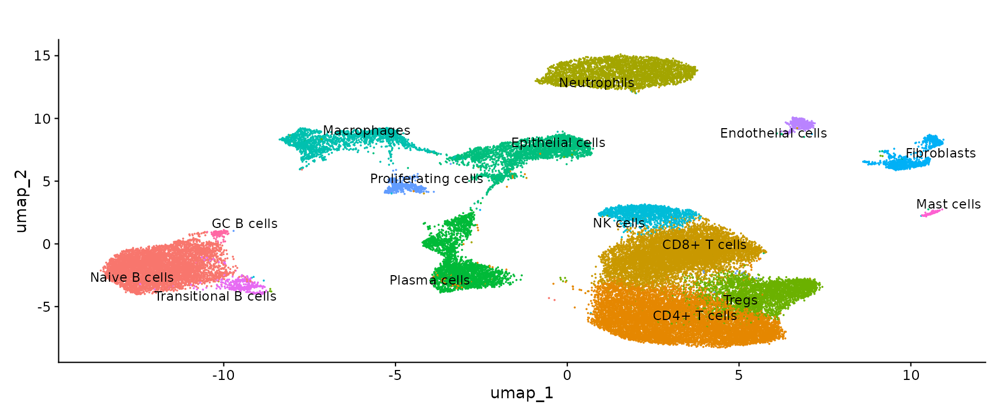
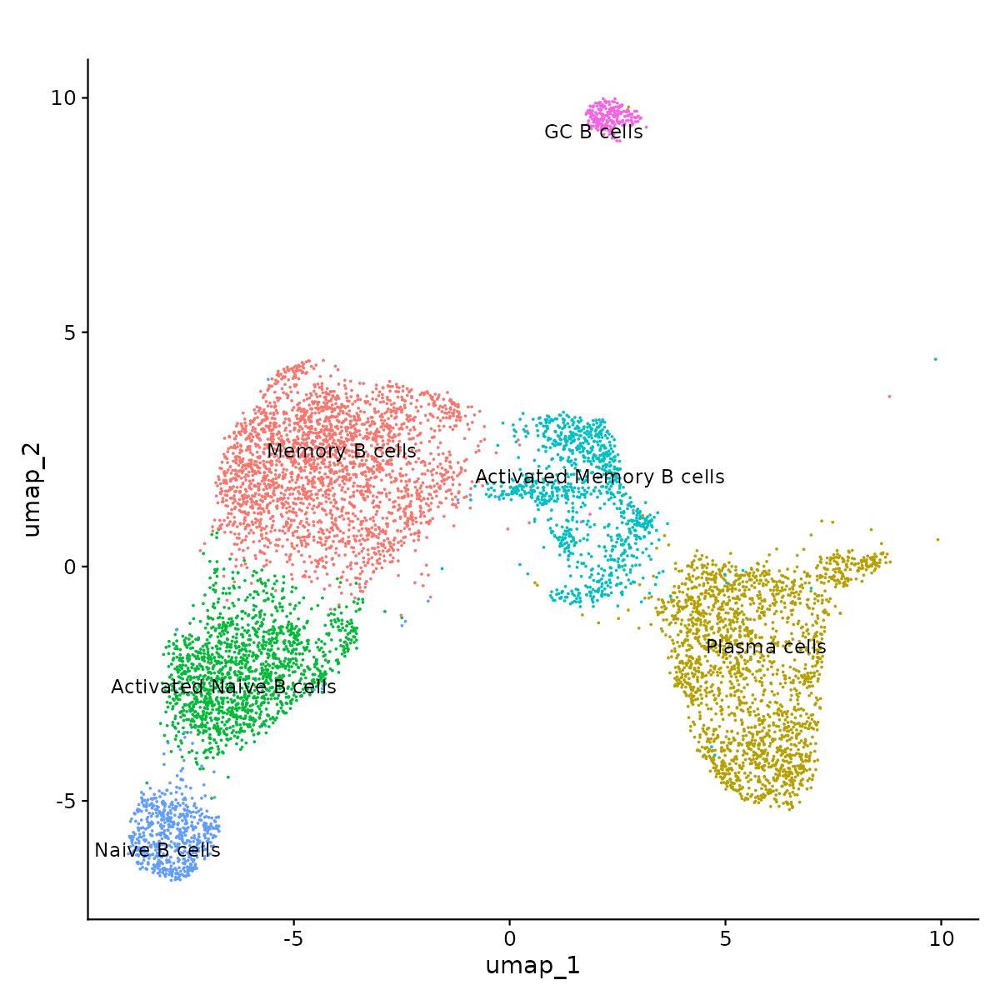
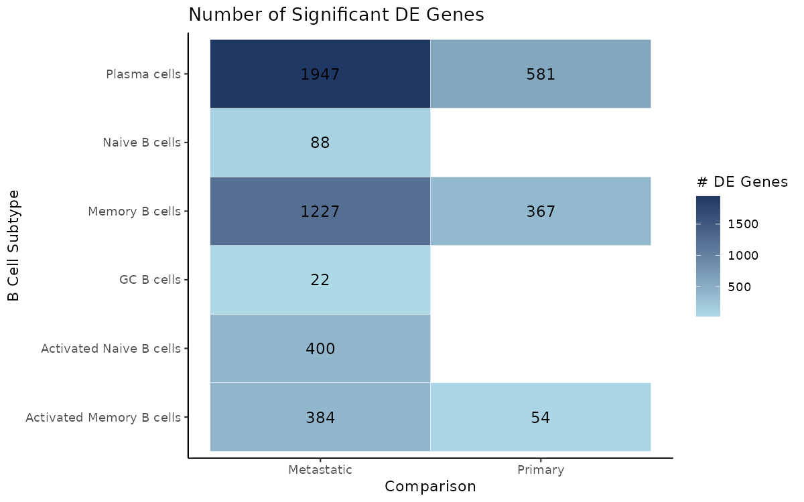
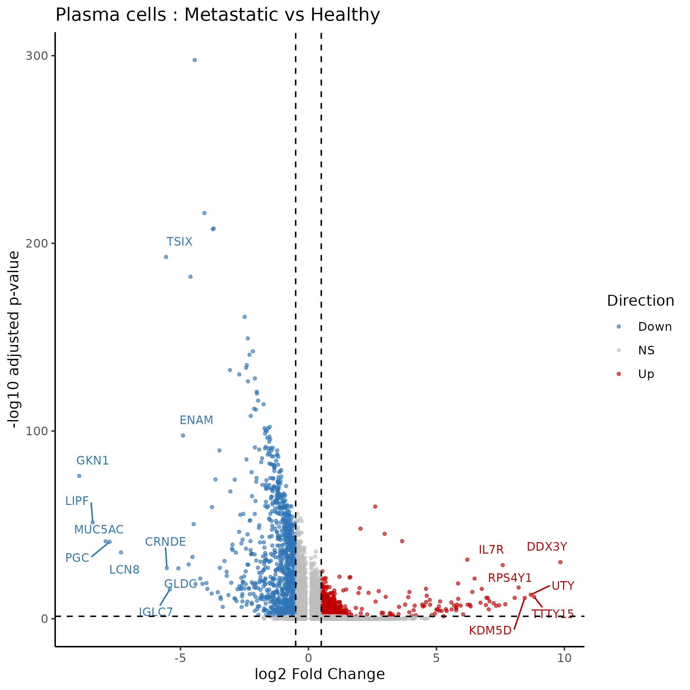
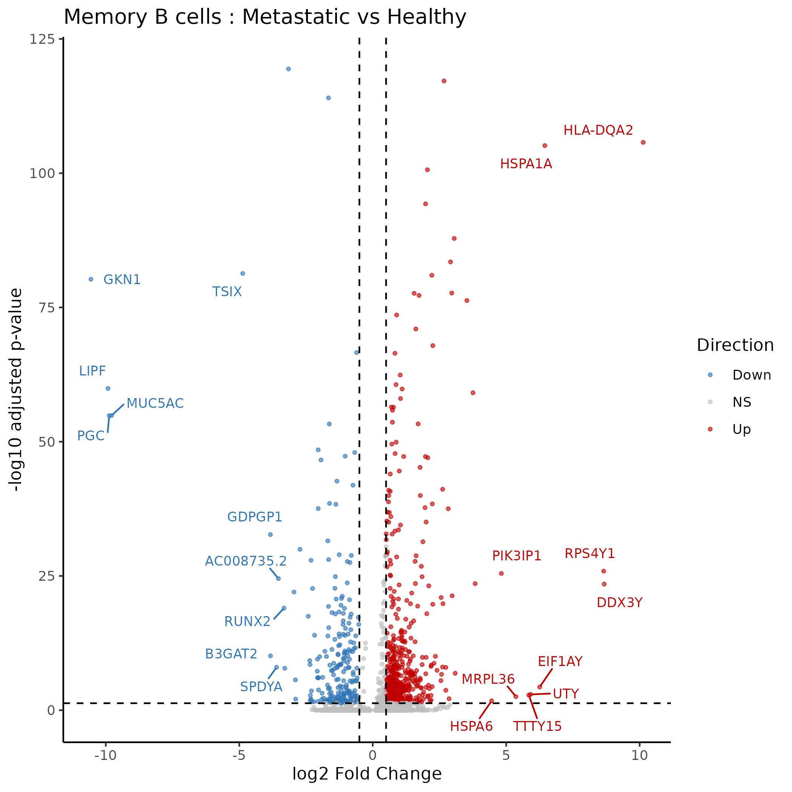
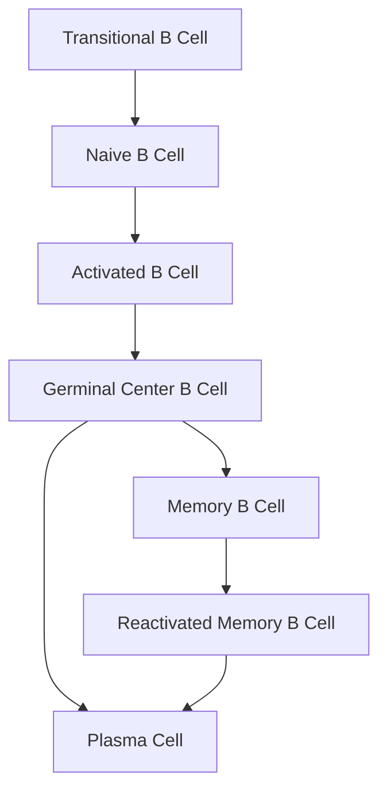
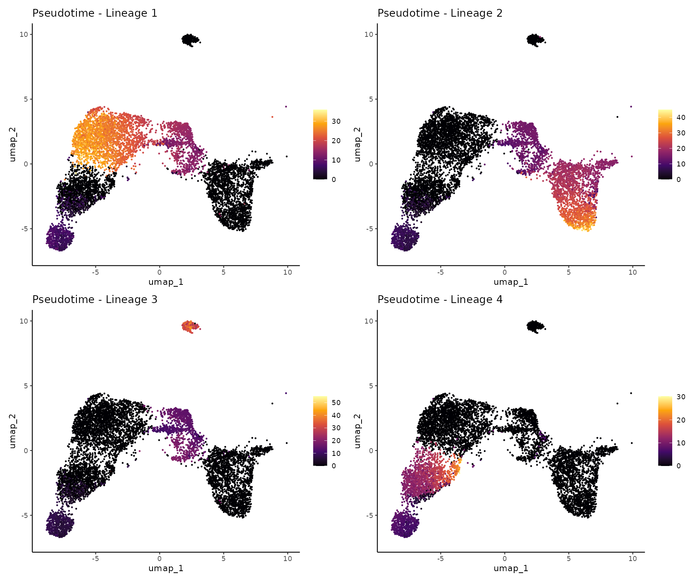

# Project Overview
This project started off with (what I thought) was a simple question: How do B cells change in the tumor microenvironment. I started by reading "Revealing the transcriptional heterogeneity of organ-specific metastasis in human gastric cancer using single-cell RNA Sequencing [1]. B cells play multiple fuctions within the TME and toggle between acting as guardians against malignancy and promoting tumor growth [2, 3]. Recently, more research is being conducted into the role that B cells play within the TME and how their presence within the TME correlates to patient outcomes. Furthermore, B cells have been a growing target for immunotherapies [4, 5] 

## Biological Question
How do B cell subsets change across healthy, primary, and metastatic cancer?

# Dataset
The dataset included 10 tissue samples from 6 patients. These samples included:
* 1 healthy tissue sample
* 3 primary gastric cancer (GC) tissue samples
* 2 liver metastasis
* 1 ovarian metastasis
* 2 lymph node metastasis
* 1 peritoneum metastasis

For overall differential expression, samples were pooled by tissue type (healthy, primary, and metastatic) to reduce comparisons and increase statistical power.

Unfortunately, there was only 1 healthy tissue sample which was taken from adjacent tissue from a patient with no metastasis. This may not be a clean representation of a healthy tissue sample since this patient did have cancer, which could have systemic effects on non-affected tissues. 

# Methods
## Quality Control (QC)
QC methodology mimicked the original authors thresholds. 
* Cells with less than 200 and greater than 5000 genes were removed removing low quality cells and doublet cells
* Cells with mitochondrial genes greater than 15% were removed which could be dying cells
* After QC, there were ~43k cells remaning, which exactly matched the original authors cell count after QC

## Batch Correction
Harmony batch correction was used on this dataset because tissue samples came from multiple different patients, which means that cells needed to be intergated for accurate comparisons. Harmony was applied after PCA, correcting for donor and organ-of-origin effects across the 6 patients and multiple tissue sites.

## Clustering
For clustering of all the cells, a resolution of 0.3 was used in the Louvain clustering model. The top 5 expressed genes were used to annotate each cluster.

## B Cell Subsetting
B cells were then subset from the full TME so they can be further explored. A resolution of 0.3 was also used here in the Louvain clustering model which resulted in 6 B cell subsets. The pipeline (normalization, scaling, dimensional reduction, etc.) was rerun on the subsetted dataset because variable features and scaling in the fulld ataset were driven by all cells, rerunning on B cells aline ensurs that variable genes and reduction reflect B cell-specific biology.

There were ~8k B cells after subsetting making up ~18% of total cells. 

## DE Analysis
For DE analysis, the subsetted B cells were condensed down into groups (healthy, primary, and metastatic) for better comparisons. This further allowed for comparison between tissue types since there were more metastatic tissue types and less controls.

An adjusted p-value of 0.05 and log2 fold change value of 0.5 was used for significance. Any group that had less than 10 cells were not used in comparisons and genes were only tested if they were in at least 10% of cells within the comparison groups. Since there were less cells in the subsets, I wanted to increase the amount of genes that were compared.

The number of DEG in each B cell subset were compared between healthy, primary, and metastatic tissue types. 

Since there were multiple comparisons, global FDR correction was performed using the Benjamini–Hochberg FDR correction method. 

*It should be noted that there were varying composition of B cell subtypes in depending on tissue type but that analysis is outside the scope of this project*

## Trajectory Analysis
Since B cells differentiate over time, the lineages of the subsetted B cells were investigated using Slingshot on grouped tissue types. Naive B cells were set as the start of the cluster because once B cells leave the bone marrow, this is their starting phenotype. 

Once lineages were discovered, the DEGs between those lineages were investigated. This was a computationally expensive step so 3k random cells were selected from the groups and analyzed. 

Lastly 2 tests (association & diff end test) were conducted to investigate how genes differ along any lineage and how they differ between lineages endpoints. 

# Results
##  Full TME
There were a total of 16 cell types found during clustering: 
* CD4+ T cells
* CD8+ T cells
* Naive B cells
* Neutrophils
* Tregs
* Plasma cells
* Epithelial cells
* Macrophages
* NK cells
* Fibroblasts
* Proliferating cells
* Endothelial cells
* Transitional B cells
* Mast cells
* GC B cells

## B Cell Subset
After subsetting, there were a total of 6 B cell types identified: 
* Memory B cells
* Plasma cells
* Activated Naive B cells
* Activated Memory B cells
* Naive B cells
* GC B cells

Here we can see that B cell differentiation moves from left to right showing that more differentiated cells (i.e. plasma cells) are further away than more naive B cells, which is biologically accurate. Away from the "normal" B cells, are germinal center cells high are highly proliferative B cells that normally form tertiary lympoid structures (TLS) in tumors. TLS indicte an active immune response and are typically correlated with improved patient outcomes [6-8].  *While these cells were not further investigated in this analysis, their proportions in each tissue type was quantified (see 05_b_cell_TME_proportions.png for more information).

## Differentially Expressed Genes in B cell Subsets
During analysis, it was observed that plasma cells and memory cells had the highest DEGs in metastatic conditions compared to healthy tissue. Interestingly, these are the cell types that are most protective of the body. Plasma cells can produce both tumor promoting and tumor killing antibodies, so it is very interesting that there were ~2k DEGs in this group. When looking at the volcano plot, many of the DEGs are downregulated, which suggests that the TME is suppressing plasma cell functions. Memory B cells, as their name suggests, act as a memory of what they should protect the body from. Since both of these B cell types are being reprogrammed within the TME, this could potentially be an avenue that should be further investigated. 

Additionally, 3 of the 6 B cell subtypes (Naive, GC, and Activated Naive B cells) had no DEG when compared to healthy tissue, indicating that as tumors become metastatic, they are biologically more different than primary tissues. 

## Trajectory Analysis
Interestingly, there were 4 lineage that were observed. Normally, B cells differentiate as seen in the figure below. However, there was an additional lineage where B cells are "stuck" in the activated stage without further differentiation. This observation can be a true representation of the TME reprograming the normal differentaiton path of B cells. Interestingly this lineage of cells is only seen in metastatic tissue samples,further suggesting that the metastatic TME is reprogramming B cells to be more naive and potentially less functional. This is an interesting find that can be further explored and validated with in vitro and in vivo experiments. 

This finding aligns with the DE analysis results, where memory and plasma cells showed the highest number of differentially expressed genes in metastatic conditions, suggesting a coordinated suppression of mature B cell function in the metastatic TME.

# Limitations
* Single healthy patient
    * Only one healthy patient limits the statistical power of healthy vs. tumor comparisons; the adjacent tissue origin of this sample may not represent truly healthy tissue
* Pooled metastatic groups lose organ-specific signals
* No pseudobulk DE correction for donor effects
* Tradeseq subsampled to 3k cells 
* No pathway enrichment analysis

# Reproducibility
All analyses were conducted in R 4.4.0 on Ubuntu 22.04.4 LTS. 

## Data
Raw data available at GEO accession [GSE163558](https://www.ncbi.nlm.nih.gov/geo/query/acc.cgi?acc=GSE163558).
Processed RDS files available at [Kaggle dataset](https://www.kaggle.com/datasets/taimcnugget/bcell-gc-tme-rds-updated).

## To reproduce
1. Download raw data from GEO or processed RDS files from Kaggle
2. Run scripts in order: 01 → 02 → 03 → 04 → 05 → 06

## Key Package Versions
| Package | Version |
|---------|---------|
| Seurat | 5.1.0 |
| SeuratObject | 5.0.2 |
| harmony | 1.2.3 |
| slingshot | 2.14.0 |
| tradeSeq | 1.20.0 |
| SingleCellExperiment | 1.28.1 |
| BiocParallel | 1.40.2 |
| ggplot2 | 3.5.1 |
| dplyr | 1.1.4 |
| patchwork | 1.3.0.9000 |
| ggrepel | 0.9.6 |
| viridis | 0.6.5 |

# Literature
1. Jiang H, Yu D, Yang P, Guo R, Kong M, Gao Y, Yu X, Lu X, Fan X. Revealing the transcriptional heterogeneity of organ-specific metastasis in human gastric cancer using single-cell RNA Sequencing. Clin Transl Med. 2022 Feb;12(2):e730. doi: 10.1002/ctm2.730. PMID: 35184420; PMCID: PMC8858624.
2. Yang H, Zhang Z, Li J, Wang K, Zhu W, Zeng Y. The Dual Role of B Cells in the Tumor Microenvironment: Implications for Cancer Immunology and Therapy. Int J Mol Sci. 2024 Nov 4;25(21):11825. doi: 10.3390/ijms252111825. PMID: 39519376; PMCID: PMC11546796.
3. Yin G, Qi L, Kang N, Li T, Li C, Liu YE, Ye J, Liu W. The Role of B Cells in Tumorigenesis and Immunotherapy. Immune Netw. 2026 Feb 24;26(1):e14. doi: 10.4110/in.2026.26.e14. PMID: 41800023; PMCID: PMC12962832.
4. Hegoburu, A., Amer, M., Frizelle, F. et al. B cells and tertiary lymphoid structures in cancer therapy response. BJC Rep 3, 40 (2025). https://doi.org/10.1038/s44276-025-00146-1
5. Gupta SL, Khan N, Basu S, Soni V. B-Cell-Based Immunotherapy: A Promising New Alternative. Vaccines (Basel). 2022 May 31;10(6):879. doi: 10.3390/vaccines10060879. PMID: 35746487; PMCID: PMC9227543.
6. Zhao, L., Jin, S., Wang, S. et al. Tertiary lymphoid structures in diseases: immune mechanisms and therapeutic advances. Sig Transduct Target Ther 9, 225 (2024). https://doi.org/10.1038/s41392-024-01947-5
7. Khanal S, Wieland A and Gunderson AJ (2023) Mechanisms of tertiary lymphoid structure formation: cooperation between inflammation and antigenicity. Front. Immunol. 14:1267654. doi: 10.3389/fimmu.2023.1267654
8. Groen-van Schooten TS, Franco Fernandez R, van Grieken NCT, Bos EN, Seidel J, Saris J, et al. Mapping the complexity and diversity of tertiary lymphoid structures in primary and peritoneal metastatic gastric cancer. Journal for ImmunoTherapy of Cancer. 2024;12:e009243. https://doi.org/10.1136/jitc-2024-009243
